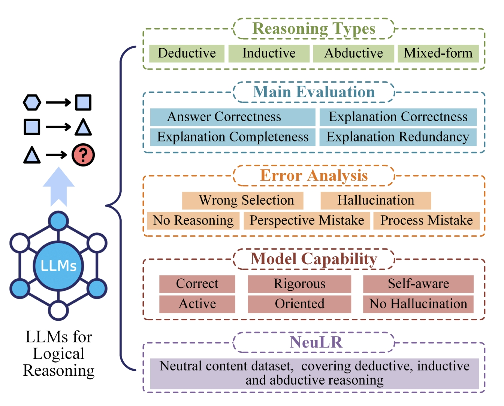

<h1 align="center">
Are Large Language Models Really Good Logical Reasoners? A Comprehensive Evaluation and Beyond
</h1>

<p align="center">
  <a href="https://github.com/xufangzhi/phi-Decoding/"><b>[🌐 PyPi Package]</b></a> •
  <a href="https://ieeexplore.ieee.org/document/10870148"><b>[📜 Paper]</b></a> •
  <a href="https://github.com/DeepReasoning/NeuLR"><b>[🐱 GitHub]</b></a>
  
</p>

<p align="center">
Repo for "<a href="https://ieeexplore.ieee.org/document/10870148" target="_blank">Are Large Language Models Really Good Logical Reasoners? A Comprehensive Evaluation and Beyond</a>"
</p>

## 🔥 News

- [2025/02] 🔥🔥🔥 Logical reasoning evaluation study of LLMs is accepted by IEEE TKDE!

## 📖 Conclusion

In this paper, in-depth evaluations are conducted on logical reasoning tasks, discussing whether LLMs are really good logical reasons
First, the logical reasoning evaluations are organized from deductive, inductive, abductive and mixed-form views. We select fifteen logical reasoning datasets to evaluate on three representative LLMs (i.e., text-davinci-003, ChatGPT and BARD) under both zero-shot and few-shot settings.
Second, this paper provides fine-level evaluations on four metrics, covering both objective and subjective views. For problematic cases, extensive error attributions are conducted from two dimensions, forming five error types. It uncovers the logical flaws of LLMs and we provide deep analysis on the results.
Third, to achieve a fair and pure benchmark for logical reasoning capability, we propose a dataset with neutral content, covering deductive, inductive and abductive settings.


<p align="center">
    
</p>

## 🚀 Quick Start

To use the $\phi$-Decoding, we can try with the following command.

Firstly, create the environment and install the requirements. This implementation is accelerated and supported by vllm.

```bash
# env
conda create -n phi-decoding python==3.10
conda activate phi-decoding
pip install -r requirements.txt
```

Next, simply run the following command after the basic configuration:

```bash
python phi_decoding.py
```


## 🔧 PyPi Package

We are currently working on providing a PyPI package. Stay tuned !


## Citation

If you find it helpful, please kindly cite the paper.

```
@article{DBLP:journals/corr/abs-2306-09841,
  author       = {Fangzhi Xu and
                  Qika Lin and
                  Jiawei Han and
                  Tianzhe Zhao and
                  Jun Liu and
                  Erik Cambria},
  title        = {Are Large Language Models Really Good Logical Reasoners? {A} Comprehensive Evaluation and Beyond},
  journal      = {IEEE Transactions on Knowledge and Data Engineering},
  year         = {2025}
}
```


# NeuLR
This is the content-neutral dataset of logical reasoning. It contains three reasoning types: deductive, inductive and abductive.

If this paper proves beneficial to your research, kindly acknowledge it by citing the following reference:
```
@article{DBLP:journals/corr/abs-2306-09841,
  author       = {Fangzhi Xu and
                  Qika Lin and
                  Jiawei Han and
                  Tianzhe Zhao and
                  Jun Liu and
                  Erik Cambria},
  title        = {Are Large Language Models Really Good Logical Reasoners? {A} Comprehensive Evaluation and Beyond},
  journal      = {IEEE Transactions on Knowledge and Data Engineering},
  year         = {2025}
}
```
